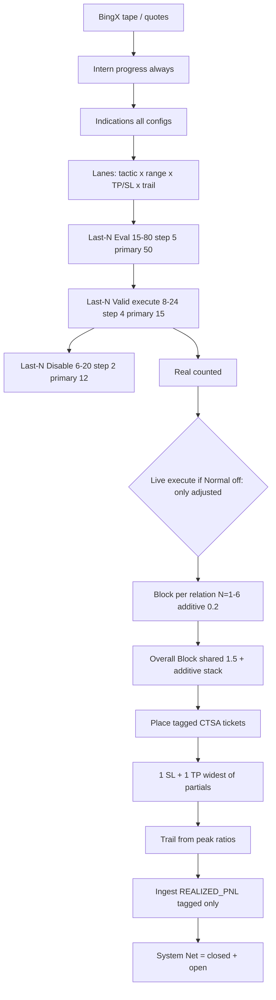

# CTS-A — Complete recreation context

**Repo:** https://github.com/mxssnx-creator/CTS-A  
**Commit this pack matches:** `e4f5dba` (2026-09-21)  
**Live host:** `152.53.114.112` · desk port **3202** · default conn **bingx-vst-02** (BingX VST demo)  
**Do-not-regress coordinations:** [`CTS-A-COORDINATIONS.md`](./CTS-A-COORDINATIONS.md) · [`CTS-A-coordinations.json`](./CTS-A-coordinations.json). Read those before changing PF, last-N, Block volumes, short GRID, or sim headlines.

CTS-A is a **multi-lane crypto futures desk**. Intern progress always computes **all** indication × tactic × range × TP/SL × trail × Block combinations. **Live / Real** only places tickets that pass last-N **valid-execute**, then Block and Overall Block add volume on winning relations. Only orders tagged for the **current connection** are handled.

---

## 1. What it is

| Layer | Role |
|---|---|
| **Desk UI** | TanStack Start + React 19 + Zustand. 16 pages. Live snapshot from host JSON, no mock tape. |
| **Engine** (`engine.ts`) | Indications, strategies, lanes, PF gates, Block math, short-range grid, replay. |
| **VST** (`vst.ts`) | Tick engine: arm, fill, protect, last-N, Block, hourly stats, overlay live book. |
| **Session** (`scripts/cts-a-vst-session.mjs`) | Live BingX loop: book, tag, protect, flatten own losers, place, ingest PnL. |
| **Feed** (`feed.ts` / `feed.server.ts`) | BingX REST, clientOrderId tags `CTSA{V1\|V2\|X1}_`, System Net filter. |

Auth and database are **off** for trading. Live state is JSON on disk.

---

## 2. Recreate / install

### 2.1 Stack

- Node 22, ESM (`"type": "module"`)
- React 19, TanStack Start / Router / Query
- Tailwind 4, Zustand, Zod, Recharts
- Vite on **`0.0.0.0:8080`** in sandbox; production desk **`0.0.0.0:3202`**

```bash
git clone https://github.com/mxssnx-creator/CTS-A.git
cd CTS-A
npm ci
npm run dev          # preview 8080
npm run typecheck
node --experimental-strip-types --test src/lib/desk/vst.test.ts src/lib/desk/feed.server.test.ts src/lib/desk/last-n-progress.test.ts
```

`startup.sh` must stay at `/workspace/startup.sh` and start `npm run dev` if 8080 is down.

### 2.2 Connections (never mix keys)

| Conn id | Tag | Network | Keys env | Default |
|---|---|---|---|---|
| `bingx-vst-02` | `CTSAV2_` | testnet (VST) | `BINGX_X02_API_KEY` / `BINGX_X02_SECRET` | **yes** |
| `bingx-vst-01` | `CTSAV1_` | testnet | `BINGX_VST_01_*` or slot | off |
| `bingx-x01` | `CTSAX1_` | mainnet | `BINGX_X01_API_KEY` / `BINGX_X01_SECRET` | off until validated |

`DESK_CONN_IDS = bingx-vst-01, bingx-vst-02, bingx-x01`.  
Client order id: `CTSA` + tag + kind (`E` entry, `S` stop, `T` TP/trail, `C` close, `L` limit) + time/rand, ≤40 chars.

**Ownership rule:** cancel / replace / protect / flatten **only** tickets whose `clientOrderId` matches **this** conn. Foreign and other CTS slots stay untouched even on the same symbol/side. Positions are owned only if a tagged ticket sits on that leg.

**System Net** = desk **closed** realized + desk **open** unrealized. Account equity includes foreign; do not display that as Net.

### 2.3 Remote (CTS-A on 152.53.114.112)

```text
ROOT=/opt/cts-a
DATA=/var/lib/cts-a
LOG=/var/log/cts-a
ENV=/etc/cts-a/cts-a.env
KEYS=/etc/cts-a/credentials.env   # mode 600
```

Units:

| Unit | Role |
|---|---|
| `cts-a-desk.service` | UI on 3202 |
| `cts-a-vst-x02.service` | live VST-02 session |
| `cts-a-vst.service` | x01 (keep **disabled** unless promoting) |
| `cts-a-backup.timer` | regular backups |

Reinstall x02 only:

```bash
bash /opt/cts-a/deploy/cts-a/reinstall-x02.sh
```

That script: backup → stop units → `git reset --hard origin/main` → npm ci → install units → **enable x02 + desk**, disable x01 → restart. **Does not flatten** foreign or own book.

x02 service defaults (`deploy/cts-a/cts-a-vst-x02.service`):

```
CTS_A_CONN=bingx-vst-02
CTS_A_NETWORK=testnet
CTS_A_LIVE_MIN_PF=0.95
CTS_A_LIVE_MAX_POS=100
CTS_A_SYMBOLS=50
CTS_A_TICK_MS=800
CTS_A_VST_HOURS=12
PORT=3202
```

State files:

```
/var/lib/cts-a/vst-session-x02.json
/var/lib/cts-a/desk-settings-x02.json
/var/lib/cts-a/overall-stats-x02.json
/var/lib/cts-a/live-disabled-x02.json
/var/lib/cts-a/protect-grid-x02.json
/var/lib/cts-a/leverage-caps.json
```

Sync from workspace: `scripts/cts-sync.sh push` (server git → origin → workspace merge → server pull → github).

---

## 3. Architecture and process order



**Order is mandatory:** last-N / relation PF / indication sets **before** Overall Block sizes extra volume.

Intern progress **never stops** when Normal is off. Normal off only blocks **live placement** of unadjusted general lanes. Base configs still score as the relation base.

---

## 4. Pages (desk)

| Path | Page | Data |
|---|---|---|
| `/` | Overview | Session, System Net, last-N, hours, playbooks, multi-symbol curves |
| `/strategies` | Strategies | Playbooks Normal/Axis/Block/DCA/Short |
| `/positions` | Positions | **Symbol+direction** count (3 symbols both sides = 6) |
| `/orders` | Orders | Complete order counts, tagged only |
| `/engine` | Engine | Tick, heal, caps, interval |
| `/combinations` | Combinations | Tactic × range cells |
| `/lanes` | Lanes | Independent sets |
| `/replay` | Replay | Up to 12d, diagrams, avg pos/orders |
| `/tactics` | Tactics | Trailing / Axis / Hybrid / DCA |
| `/performance` | Performance | PF, DDT, MDD |
| `/results` | Results | Live tape, independent of Statistics |
| `/statistics` | Statistics | Live exchange buckets only |
| `/heatmap` | Heatmap | PF cells |
| `/system` | System | Loads, JSON store, CPU/mem |
| `/settings` | Settings | All values + presets |
| `/connections` | Connections | x01 / vst-01 / vst-02 |

UI must **patch data in place** — no full page reload, no scroll-to-top.

---

## 5. Defaults (authoritative)

### 5.1 Account / size

| Key | Default | Notes |
|---|---|---|
| Position size | **0.12%** of equity (`POSITION_COST_PCT = 0.0012`) | Live notional uses 0.3× this × Block VR |
| Position RT cost | **0.12%** of notional (`POSITION_RT_COST_PCT = 0.0012`) | Deducted from every close / PF / last-N / MTM. Live actual ~0.10%. Never 5 bps. |
| Base equity (sim) | 10_000 | Live uses BingX equity |
| Min size ratio | 1 | Always lift to exchange min qty / min notional |
| Leverage | **max per contract** | `useMaxLeverage=true`, `leverage=0` |
| Margin | **cross** | |
| Hedge | **both directions** | `hedgeMode=true`, Block `sides=both` |
| Symbols | 8–120, live x02 **50** | Ranked by 1h volatility |
| Max positions live | 400 (budget also 16–80 by equity) | Paper 2500 |
| Max working orders | 2400 | Paper 8000 |
| Tick | 400 ms intern; live x02 **800 ms** | 1 tick = 1 minute of sim time |
| Cycle | 40 s live, short cycle 12 s | |

### 5.2 PF floors (Overall ≥ each stage)

| Gate | Default | Short-range |
|---|---|---|
| Overall min PF | **1.35** | **0.95** |
| Base PF (Normal / general) | **1.0** | **0.70** |
| Axis PF | **1.15** | **0.90** |
| Block PF | **1.20** | **1.15** |
| Live disable min PF | Block PF | 1.1 stable / 1.8 strict presets |
| Max MDD | 0.12 | |
| Min WR | 0.55 | |
| Min volume factor | 1.12 (hard floor 1.05) | |
| Max DDT | 18 | |
| PF no-loss cap | 4 | |

Higher Overall PF **does not starve** winners: headline is the **positive subset** above the floor, never 0.20 paper when nSel=0.

x01 live: min PF 1.35–1.8, 50–120 symbols, SL min 0.4, TP min 0.6 on extra ranges.

### 5.3 Last-N progress (multi-range, coordinated — not a full parallel engine)

| Stage | Grid | Primary | Role |
|---|---|---|---|
| Eval (base) | 15–80 step 5 | **50** | Score every lane |
| Valid execute | 8–24 step 4 | **15** | Lane is valid → Real / Live |
| Disable | 6–20 step 2 | **12** | Off if last-N average **net < 0** (min samples 4) |

Mode default **`parallel`**, `parallelStack=true`, `parallelVolRatio=1.25`.  
Also `independent` and `combined`. Calc **before** Overall Block.

Other last-N (settings): picks 15, lanes 30, last 12, ongoing 15, next 15, combos 30.

Stage hours auto-eval: **4 / 8 / 16** (pre / mid / end) plus 20h short pre-historic. Symbol eval **100h**. Hour windows 4,8,16,20,24,48,100.

### 5.4 Strategies / playbooks

| Toggle | Default live | Meaning |
|---|---|---|
| Normal (general) | **OFF** | Intern still computes; live does not place unadjusted |
| Trailing | ON | If off, trailing overlay not used for further strategies |
| Axis | ON | Extra rungs = **full** base qty (`AXIS_PARTIAL_RATIO=1`). Never 0.08 |
| Block | ON | Shared + additive + Overall |
| DCA | **OFF** systemwide | |

Playbooks: `normal`, `axis`, `block`, `dca`, `short`.  
Tactics: `trailing`, `axis`, `hybrid` (live). `dca` intern only while disabled.  
Ranges: `linear`, `geometric`, `atr`, `volume`, `fibonacci`. Preferred live: **atr / geometric / fibonacci**.

### 5.5 Block

Counts **1–6** independent (each N is its own window). Stack extra 1–2 (old type) plus 1–6 (new type).

| Mode | Volume ratio | Math |
|---|---|---|
| Additive (relation) | **0.2** (never 0.08) | extra = N × 0.2 × base |
| Shared (old) | **1.5** | extra split across live count when n>2 |
| Overall Block | **1.5** | Independent of lanes; **additive on shared stack** across symbol / direction / book |
| Max multiplier | **2.5** | total ≤ 2.5× parent base. Cap extra vs **base + existing Block qty only** (GRID legs must not starve Block) |

`volumeMode=parallel`, `overallMode=parallel` (Stable 01 overallMode **shared**).  
`activeLive=true`, `minActiveLevel=1` → only **adjusted** blocks go live when Active is on.  
`keepAdjusted=true` — keep increased volume until back in positive.  
`pauseCountRatio=1` (pause 0,1,2 tested).  
`flattenConflict=false` — do not flatten opposite side.  
`sides=both`.  
`relAdditive=true`.  
Eval last Ns `[1,2,3,4,5,6]`. Recalc ~2h (`evalHours=2`).  
Overall scopes: **book**, **symbol**, **direction** — each independent, volumes add.

Example (user spec): 3 winning block counts, ratio 1, base 1.2 → `3 × 1 × 1.2` additive. Live default ratio is 0.2 additive / 1.5 shared.

### 5.6 Short-range (own settings section)

Intern grid (all independent):

- TP ATR **0.30–0.60** (0.30, 0.32, 0.34, 0.36, 0.38, 0.40, 0.42, 0.45, 0.48, 0.50, 0.52, 0.55, 0.58, 0.60)
- SL of TP **0.50–2.50 step 0.25**
- 14 × 9 = **126 combos**

Live floors (independent-tape winners, screenshot 28 Base-positive): **min TP 0.38**, **min SL/TP 0.75**, max TP 0.60. Winner `TP 0.42 / SL 1.50`. Block overlays `0.40/1.00` and `0.52/0.75`.

Short PF: overall 0.95, base 0.70, axis 0.90, block 1.15.  
Short eval hours **20**, `evalPositiveOnly=true`, `bestOnly=true`.  
Hold: maxHoldTicks **16** (~16 min), indication hold mul (Break 1.45).  
Trail live: **1.5%** only. Disabled trails: 0.8, 1.0, 1.2, 1.4, 1.7, 2.0 (too tight / live losers).  
Trail giveback ratios of peak: `0.9, 0.78, 0.66, 0.54, 0.44, 0.36`.

Normal (non-short) TP ATR **0.8–1.6 step 0.1**, SL of TP **1.0 and 1.25** only (0.5/0.75 too tight live).

### 5.7 Indications (independent configs)

Kinds: trend, break, active, direction, move, rsi, bollinger, sar, macd, ema.

| Kind | Configs |
|---|---|
| Trend | EMA 9/21, ADX 26, Supertrend, ribbon 9/21/55 |
| Break (breakout) | volume 1.6×, ATR 1.15×, 12-bar, close+vol 16, retest, fail fade, squeeze, NR7 |
| Active | HF, range shift, burst, chop fade |
| Direction | EMA cross, ST flip, VWAP axis, MACD flip, RSI div, hold, 3-bar thrust, EMA21 reclaim |
| Move | impulse, swing 8, continuation |
| RSI | extreme, mid, divergence |
| Bollinger | bounce, squeeze, walk, mid reclaim, wick tag |
| SAR | flip, hold, trail |
| MACD | cross, hist, zero-line |
| EMA | 9/21, 21/55, ribbon, cross, pullback |

Break protect: SL×1.18 / TP×1.55 / hold×1.45; mag ≥ 0.22; Donchian exclude current bar; wick-only + chasing filters. Quality floor 0.34 (per-kind floors in `INDICATION_QUALITY_FLOORS`).

Each indication × tactic × range × short combo is an independent **relation**. Block and last-N run **per relation** (and per sub: symbol, side, indication, config, strategy, protect cell).

### 5.8 20-minute interval strategy

Enabled. Minutes 20 (options 10/15/20/30/40/60).  
Scale vol 0.4–1.2. Lean PF 1.45, cut PF 0.9, hold 1.05.  
Stable green 3, red cut 2, hist windows 4.  
Red windows **cut size, do not halt entries**. Relation haircut 0.4, boost 1.08, keep PF 0.85.

### 5.9 Protect / control orders

- Common SL/TP = **widest** among independent partials (farthest stop, farthest target)
- 1 SL + 1 TP per owned leg; **do not return early** if they exist but SL is looser than cell — pull in
- Trail from **peak**, not entry
- Never `closePosition` on mixed foreign+own legs
- Manual close of our position: **keep processing** (release vanished, forget tags, continue)
- Foreign positions: never flatten, never attach, never cancel

### 5.10 Presets (`src/lib/desk/presets.ts`)

| id | Use |
|---|---|
| `x01-live` | Mainnet 120, trail 1.5, Block 1–6, PF 1.35 |
| `vst-paper` | VST-02 hybrid/geometric 120 |
| `strict-pf` | min PF 2.0, Block 1–3 |
| `conservative` | 25 symbols, one side, Block 1–2 |
| `block-core` | Block 1–3 only |
| `short-block-live` | indications + short + Block Active 1-step, PF 1.8 |
| `stable-01` | saved live snapshot: x01, 50, trailing/atr, short 0.42/1.75, Block 1–6 |

Settings persist in `desk-settings-x02.json` and sync project-wide (sliders, toggles, last-N).

---

## 6. Relations (major and minor)

A **relation key** is built from:

```
symbol + side + indication + indicationConfig + tactic + range + playbook + protectCell(tp,sl,trail) + blockN + volMode + overallScope
```

Independently processed:

1. Base lane (Normal intern)
2. Axis overlay (full-size partials)
3. Block N=1..6 additive
4. Block shared
5. Overall Block book / symbol / direction
6. Short-range combo key `tp:sl`
7. Interval 20m scale
8. Last-N eval / valid / disable (multi N, parallel stack)

Volume **adds**. PF is computed on that relation’s own closes (qty-weighted). Winning relations raise `relVolumeFactor` (live mul 0.35–0.8). Losing last-N disable that key only.

Live execute gate: `liveShouldExecute` after valid-execute last-N **and** not in `liveDisabled`. When `strategyToggles.normal === false`, only `kind !== normal` / Block-adjusted / short playbook go to the exchange.

---

## 7. Live session loop (`cts-a-vst-session.mjs`)

1. Init engine, conn=`bingx-vst-02`, shortRange, liveTape, Block on, DCA off  
2. Seed disabled + lastExec from overall JSON (filtered desk PnL)  
3. Ping BingX, ensure hedge+cross, walk max leverage  
4. Each cycle: tape → tick intern → `mirrorToExchange`  
   - refresh tagged keys from open orders  
   - desk pos = owned legs only; foreign counted, **held**  
   - `ensureProtect` tagged only (pull wide SL, trail, 1+1)  
   - `flattenBelowMinPf` **owned** past-SL or hold>16–24 min losers only  
   - place fills/queue intents if budget, protect gap=0, not pf-gated  
5. Snapshot: ingest tagged PnL → overallLiveStats → overlayExchangeBook(owned) → **systemNet = closedNet + openNet**  
6. Write session + overall JSON atomically  

Caps: batch 48, rate 16/s burst 40. Heal on NaN. No flatten of whole book.

---

## 8. Source map (do not invent a parallel engine)

```
src/lib/desk/engine.ts          indications, PF, Block math, grids, DESK
src/lib/desk/vst.ts             tick, arm, stats, overlay, last-N coord call
src/lib/desk/last-n-progress.ts multi last-N
src/lib/desk/short-progress.ts  short PF section
src/lib/desk/interval-strategy.ts 20m
src/lib/desk/feed.ts            tags, filterDeskRealized, systemProcessedNet
src/lib/desk/feed.server.ts     BingX REST
src/lib/desk/store.ts           Zustand desk
src/lib/desk/settings-sync.ts   settings snap
src/lib/desk/presets.ts         named presets
src/lib/desk/live-ctx.tsx       System Net / foreign in UI
scripts/cts-a-vst-session.mjs   live host
deploy/cts-a/*                  systemd, reinstall, backup
```

---

## 9. Invariants (do not regress)

Full list + fail tapes + pass bar: **`CTS-A-COORDINATIONS.md`**. Summary:

1. Intern always runs complete combinatorics. Live is a **filter**.  
2. Axis partial ratio is **1.0**, Block additive **0.2**. **0.08 is forbidden** (was a live-killer).  
3. Handle **only** current conn tagged tickets.  
4. System Net = processed closed + owned open.  
5. Positions count = **symbols × directions present**. Orders = complete count.  
6. Common protect = widest of partials.  
7. No mock tape on Results / Statistics / System.  
8. No full-page refresh / scroll-to-top.  
9. DCA off. Tight trails off.  
10. Max leverage always. Min qty always lifted.  
11. Last-N before Overall Block.  
12. Paper complete sim must not skip arming.  
13. Foreign flatten = 0.  
14. **No exclusive short lock.** Use all performing cells after pre (floors 0.38 / 0.75).  
15. Headline = selected/performing tape. Never mix intern paper into live last-N / hours.  
16. Higher min PF keeps winners on the **same path**; never show 0.20 paper when nSel=0.  
17. Engine size factor is **1**. Tape VF ≥ 1.05. 1.08 is Axis leftover — not engine volume.

---

## 10. Current live x02 snapshot (after e4f5dba)

- Conn `bingx-vst-02` VST testnet  
- 17 owned positions, 34 control orders (1 SL + 1 TP)  
- Foreign 0p / 0o  
- Closed Net ~+33.91 · Open ~+1.17 · **System Net ~+35.08**  
- Tactic trailing · range atr · short grid live floors  
- Normal off · Block on · DCA off  

---

## 11. How to stand up a twin

1. Clone CTS-A @ `e4f5dba` or `main`.  
2. Copy `deploy/cts-a/credentials.env.example` → `/etc/cts-a/credentials.env` with BingX **x02 VST** keys only.  
3. Copy `cts-a.env.example` → `/etc/cts-a/cts-a.env` (port 3202, conn vst-02).  
4. `bash deploy/cts-a/reinstall-x02.sh`.  
5. Load preset **vst-paper** or **stable-01** (short+block) in Settings. Keep Normal off, DCA off, max leverage, hedge both.  
6. Confirm tags `CTSAV2_`, protect gap 0, System Net = closed+open, foreign held.  
7. Do not arm `bingx-x01` until VST PF is stably ≥ x01 min PF on the same configs.

Defaults JSON next to this file is the machine dump of every numeric default above.
